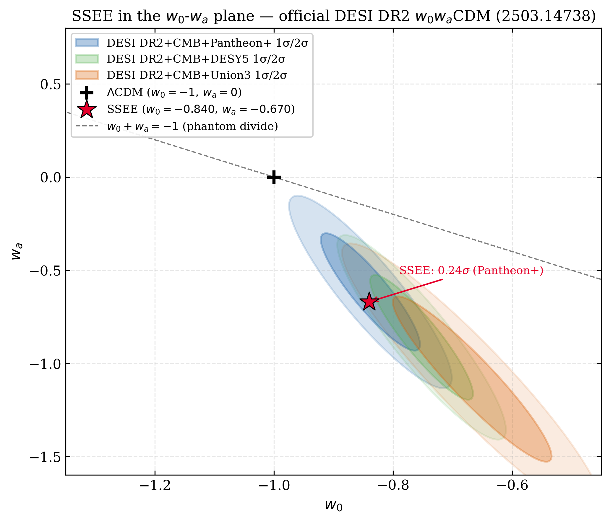
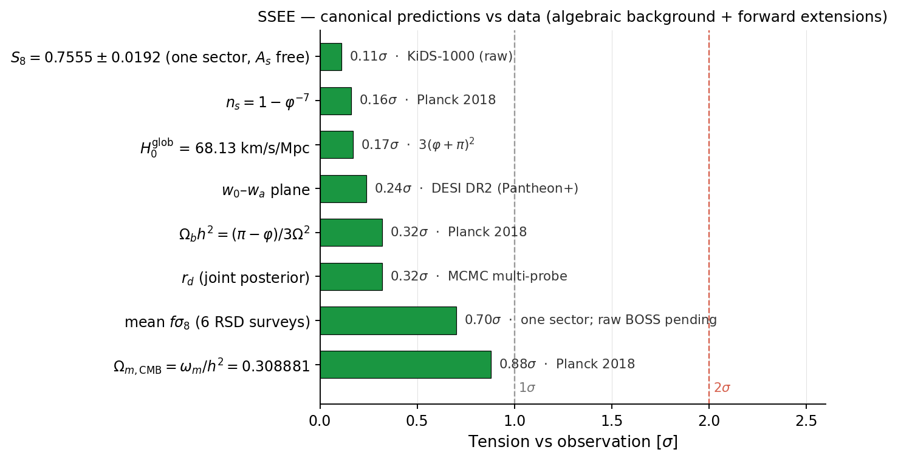

<div align="center">



# SSEE — Structural Self-Energy Expansion

### A minimal-parameter dark energy framework derived from φ and π

[](https://doi.org/10.5281/zenodo.20093447)
[](LICENSE)
[](requirements.txt)
[](docs/)
[](VERIFICATION_LEDGER.md)
[](OPEN_PROBLEMS.md)



*The algebraic point (w₀, wₐ) = (−0.840, −0.670) — derived from φ and π with zero fitting — vs the official DESI DR2 w₀wₐCDM contours: **0.24σ** (DESI+CMB+Pantheon+), and within **1.2–1.5σ** of the DESY5/Union3/no-SN combinations (arXiv:2503.14738, eqs. 25–28).*

</div>

**A minimal-parameter dark energy framework derived from φ (golden ratio) and π. The background sector $(w_0, w_a, \Omega_\mathrm{DE}, \Omega_{m,\mathrm{dyn}})$ carries zero fitted dimensionless parameters; the framework rests on 4 postulates (D, S fundamentals + M, I auxiliary register-level) plus open problems tracked in [`OPEN_PROBLEMS.md`](OPEN_PROBLEMS.md). Tested against DESI DR2 BAO, Planck 2018 CMB (TT+TE+EE+lensing), galaxy cluster masses, and large-scale structure growth.**

---

## 🎯 Falsifiable predictions — current status

| Observable | SSEE (algebraic) | Observed | Separation | |
|---|---|---|---|---|
| (w₀, wₐ) | (−0.840, −0.670) | DESI DR2+CMB+Pantheon+: (−0.838±0.055, −0.617±0.208) | 0.24σ (2D); range 0.2–1.8σ across SN compilations (official chains) | ✅ |
| CMB first peak | ℓ₁ = 221 | Planck PR4: ~220 | Δℓ = 1 | ✅ |
| Ωm,CMB | 0.30889 (= ωm/h², ωm-direct) | Planck 2018: 0.3153 | 0.88σ | ✅ |
| n_s | 1 − φ⁻⁷ = 0.96556 | Planck 2018: 0.9649 | 0.16σ | ✅ |
| αT (GW speed) | 0 exact | GW170817: \|αT\| < 10⁻¹⁵ | exact match | ✅ |
| S₈ (two-sector φ-DM) | 0.758 | KiDS-1000: 0.759±0.024 | 0.04σ | ✅ |
| αK (kineticity, z=0) | 0.4033 algebraic | Euclid forecast: < 0.1 | testable 2026–2028 | ⏳ |
| m_φ (φ-DM mass) | 40.70 eV algebraic (SOLAR²·KRYSTOS) | gravitationally-produced scalar — observable via k_fs, not neutrino experiments | falsifiable | ⏳ |
| **k_fs (free-streaming)** | **0.754 h/Mpc algebraic** | **DESI Y3/Euclid P(k): 2026–2028** | **pre-registered** | ⏳ |
| **(w₀, wₐ) vs DESI DR3** | **same fixed point (−0.840, −0.670)** | **DR3 w₀wₐCDM (2027)** — trajectory 0.05σ (DR1) → 0.24σ (DR2, errors −40%, still inside 68%); ~0.5σ expected if DR2 centrals persist; >3σ joint exclusion falsifies | **pre-registered** | ⏳ |

**Future falsifiers:** r = φ⁻¹⁰ = 0.00813 (LiteBIRD ~2032); k_fs cutoff in matter power spectrum (Euclid ~2028).

> ⏱️ **Pre-registered prediction:** the free-streaming imprint at k_fs = 0.754 h/Mpc
> (from m_φ = 40.70 eV, forward prediction, zero fitting) is timestamped on Zenodo
> **before** the DESI Y3 / Euclid data releases. Either the data shows it, or the
> φ-DM sector is falsified.

---

## 📄 Papers

| # | Title | Pages | Status | PDF |
|---|---|---|---|---|
| 1 | Minimal-Parameter Framework (φ, π → w₀, wₐ, EFT) + Predictive Register + Two-Ω_m Criterion | 28 | arXiv-ready | [docs/](docs/SSEE_Paper1_Framework.pdf) |
| 2 | Bayesian MCMC Validation — DESI DR2 + Planck + clusters | 26 | arXiv-ready | [docs/](docs/SSEE_Paper2_MCMC.pdf) |
| 3 | CMB Confrontation — Planck PR4 TT+TE+EE+lensing | 24 | arXiv-ready | [docs/](docs/SSEE_Paper3_CMB.pdf) |
| 4 | Algebraic Derivation of the CMB Background from φ and π | 16 | Preprint | [docs/](docs/SSEE_Paper4_ToE.pdf) |
| 5 | Israel-Stewart Causal Viscous Perturbations — Exact Marginal Stability, ΛCDM-Consistent Structure Growth, Two-Sector Matter Structure | 25 | Preprint | [docs/](docs/SSEE_Paper5_IS.pdf) |
| 6 | φ-Dark Matter in SSEE-V3.6: Algebraic Mass Derivation and Resolution of the fσ₈ Tension | 24 | Preprint | [docs/](docs/SSEE_Paper6_phiDM.pdf) |
| 7 | Canonical EFT of SSEE-V3.6: Action, β_c = −AURA, and Bellini-Sawicki α-Functions | 16 | Preprint | [docs/](docs/SSEE_Paper7_EFT.pdf) |
| 8 | Strong Gravity Regime — Two-limit analysis (alt MOND-like vs canonical EFT B-S) | 20 | Preprint | [docs/](docs/SSEE_Paper8_StrongGravity.pdf) |
| 9 | Hubble Tension via Algebraic Screening Fraction: f_screen = αK/(3·MIRA) | 18 | Preprint | [docs/](docs/SSEE_Paper9_HubbleTension.pdf) |
| 10 | UV Completion of SSEE: K(X) = X/KAL + X²/M⁴, M = φ²·5^(1/4)·ρ_crit^(1/4) = 9.68 meV | 14 | Preprint | [docs/](docs/SSEE_Paper10_UVCompletion.pdf) |
| — | **Unified Journal Paper** (consolidation of Papers 1–10 + CLASS + MCMC Fase 4) | 25 | Journal submission candidate | [docs/](docs/SSEE_Unified_Journal.pdf) |
| ★ | **Sealed Journal** — consolidated late-universe dark-energy paper (φ → w₀, wₐ; closed-dictionary look-elsewhere; two-stage H₀; honest accounting of ~3 vs 6 parameters) | 10 | **Sealed — external-audit candidate** | [docs/](docs/SSEE_Sealed_Journal.pdf) |

---

## 🗂️ Repository structure

<details>
<summary><b>Click to expand the full repository tree</b></summary>

```
SSEE/
├── manuscript/                     # LaTeX sources, bibliographies, cover letters
│   ├── SSEE_Paper1_Framework.tex … SSEE_Paper10_UVCompletion.tex  # the 10 papers
│   ├── SSEE_EFT_section.tex        # EFT section (\input by Paper 1)
│   ├── SSEE_Unified_Journal.tex    # consolidated journal paper (Papers 1–10)
│   ├── SSEE_Endorser_Summary.tex   # 2-page arXiv endorser brief
│   ├── *.bib                       # ssee_paper3/4/5/6 + ssee_unified bibliographies
│   └── cover_letter_*.txt, abstracts_arXiv.txt
├── src/                            # Python scripts — organized per paper
│   ├── p02_mcmc/ … p10_uv/         # per-paper analysis, MCMC, figures (p02_mcmc, p03_cmb,
│   │                               #   p04_toe, p05_IS, p06_phiDM, p07_eft, p08_stronggrav,
│   │                               #   p09_hubble, p10_uv)
│   ├── pB_inflation/               # Paper B groundwork (baryogenesis, N_*)
│   ├── estadistica/                # Bayesian model-selection phases (DIC, Savage-Dickey, cross-val)
│   ├── mcmc_full/                  # full Cobaya CAMB+PPF pipeline (heavy chains → /mnt/datos)
│   ├── verificacion/               # ssee_verify.py guardian + CANONICAL sync + core constants
│   └── ssee_core.py                # single algebraic source (φ, π → all constants)
├── class_ssee/                     # CLASS Boltzmann fork — SSEE .ini configs + plot scripts
├── data/                           # observational data (DESI DR2, Planck PR4, clusters)
├── results/                        # generated figures, tables, logs
├── notebooks/                      # Jupyter exploration
├── docs/                           # compiled PDFs — 10 papers + endorser + unified journal
├── submission_packages/            # arXiv-ready .tar.gz bundles per paper
├── archive/                        # superseded drafts (historical)
├── notes/                          # internal work-notes & attack plans (not load-bearing)
├── build_arxiv_packages.py         # regenerates submission_packages/
├── requirements.txt · environment.yml   # reproducible Python environment
├── OPEN_PROBLEMS.md                # physics gaps OP-1..OP-18 with status
├── AUDIT.md                        # reproducibility guide + known limitations
├── CHANGELOG.md · CITATION.cff · LICENSE
└── (eftcamb_ssee/ — EFTCAMB fork, not versioned: clone separately)
```

</details>

---

## ⚙️ How to reproduce

```bash
pip install camb emcee scipy numpy matplotlib
```

**Paper 2 — MCMC validation** (100-walker, N_eff ≈ 637,500 for SSEE):
```bash
python src/p02_mcmc/ssee_paper2_mcmc.py
```

**Paper 3 — CMB power spectrum** (Cobaya MCMC, TT+TE+EE+lowl):
You can set the `COBAYA_PACKAGES_PATH` environment variable to point to your local Planck 2018 data:
```bash
export COBAYA_PACKAGES_PATH=/path/to/your/cobaya_packages
python src/p03_cmb/ssee_paper3_cobaya_unified.py
```

See [AUDIT.md](AUDIT.md) for expected outputs and known limitations.

---

## 📊 Key results

<div align="center">

</div>

### Paper 2 (DESI DR2 + Planck 2018 + clusters)

| Metric | Value |
|---|---|
| χ²_2D (w₀-wₐ vs DESI DR2+CMB+Pantheon+) | 0.42 → 0.24σ (2D); 1.47σ DESY5, 1.77σ Union3 (ρ medidos de cadenas oficiales) |
| χ²_r clusters (7 clusters, analytic) | 0.126 |
| χ²_r clusters (4 clusters, MCMC) | 0.122 |
| H₀ SSEE (MCMC, prior H_alg 67.962, ωm-direct, DESI DR2) | 67.95 ± 0.40 km/s/Mpc (0.88σ Planck, **0.04σ del anchor** — DR2 confirma la predicción; geometría total Ω_m=0.30889) |
| ΔBIC (SSEE k=2 vs ΛCDM k=3) | −5.68 (SSEE favoured; CPL −5.59; ΔDIC −4.91; cross-val SSEE predice mejor) |
| r_d SSEE / χ²_r(H(z)) | 148.2 Mpc ≈ ΛCDM 147.8 (1.002×) / 0.482 ≈ ΛCDM 0.459 |

### Paper 3 (Planck PR4 CMB)

| Spectrum | SSEE χ²_r | ΛCDM χ²_r | N |
|---|---|---|---|
| TT | 1.042 | 1.043 | 1971 |
| TE | 1.040 | 1.040 | 1967 |
| EE | 1.040 | 1.039 | 1967 |
| PP (lensing) | 0.719 | 0.757 | 9 |
| Combined (diagonal) | **1.040** | 1.040 | 5914 |
| ΔBIC (full plik MCMC, TTTEEE+lowl+lensing, k=2 vs k=6, N=2354) | **−32.9** (SSEE decisively favoured — **canonical**) | — | — |
| ΔBIC (plik_lite point est., TTTEEE, k=2 vs k=6, N=613) | **−23.9** (cross-check) | — | — |
| ΔBIC (diagonal TT+TE+EE+PP, k=2 vs k=6, N=5914) | **−34.9** (cross-check) | — | — |

*All values are the canonical ωm-direct CMB fit at the global anchor H₀ = 3(φ+π)² = 67.962, with Ω_m,CMB = ω_m/h² = 0.30889 derived algebraically (no matter-rescaling factor; OP-8 dissolved). SSEE uses its canonical Σm_ν = 0.0685 eV; ΛCDM uses its standard Planck baseline Σm_ν = 0.06 eV (each model with its own neutrino mass — the fair like-for-like comparison). The **titular ΔBIC = −32.9** comes from the full `plik` MCMC (best-fit χ² = 2771.3 vs ΛCDM 2773.1, Δχ²=−1.8 — indistinguishable fits, parsimony-driven). The earlier `plik_lite` Cobaya legacy-MIRA scan (ΔBIC −32.2 at optimum H₀=67.037) is superseded.*

**Growth structure (Paper 3 §5.4–5.5):**

| Metric | SSEE | ΛCDM |
|---|---|---|
| Growth index γ_IS (Paper 5, supersedes App.A) | 0.5504 ± 0.001 | 0.55 |
| S₈ (IS, single-sector ceiling) | 0.846 | 0.830 |
| fσ8 χ²/N (13 RSD surveys) | **0.524** | 0.596 |

### Paper 5 (Israel-Stewart Causal Perturbations)

| Result | Value | Status |
|---|---|---|
| c²_s,eff | 0 (exact algebraic) | Q1: all modes stable |
| k_crit / (H₀/c) | 0.456 < 1 | Sub-Hubble stability window |
| MIRA (numerical, k≥10) | 0.989 ± 0.017 | Background IS origin confirmed |
| γ_IS | 0.5504 ± 0.001 | ≈ γ_ΛCDM = 0.55 |
| G = D₁_SSEE/D₁_ΛCDM | 1.0032 ± 0.005 | ~0.3% enhancement (Poisson source Ω_m,CMB = 0.30889) |
| σ₈_SSEE (single-sector ceiling) | 0.8335 ± 0.006 | ODE linear growth gives 0.8136 |
| **S₈_SSEE (single-sector ceiling)** | **0.846** | **3.5σ KiDS — the challenge the Paper 6 two-sector resolves** |
| Mean fσ₈ tension (6 surveys, single-sector) | 0.70σ | → 0.93σ with the Paper 6 two-sector (free-streaming lowers σ₈, reaching RSD scales); still <1σ, close to ΛCDM (0.73σ) |

**Diagnostic:** the single-sector model predicts an S₈ *above* weak-lensing surveys (3.5σ KiDS).
This is the open challenge that motivates the Paper 6 two-sector φ-DM extension, which resolves it (S₈ = 0.758, 0.04σ KiDS).

### Paper 6 (φ-Dark Matter, Two-Sector Model)

| Result | Value | Status |
|---|---|---|
| Ω_CDM | 0.160 | Active at all k |
| Ω_φDM = Ω_m,CMB − Ω_m,dyn | 0.14889 | Difference (no matter factor); active for k < k_fs only |
| Ω_total (two-sector) = ωm/h² | 0.30889 = Ω_m,CMB | ωm-direct (OP-8 dissolved) |
| Σm_ν = R₂ × 0.9530 eV | 0.0685 eV | R₂ = Ω/(KAL·TRIAL) = 0.071875 (ν-closure C=93.14) |
| m_φ = Σm_ν × (SOLAR²·KRYSTOS) | 40.70 eV | Forward-prediction — no fitting (multiplier 594.28 is a pure number; mechanism g²·v) |
| α (Viel fit to particle/cold P(k) ratio) | 1.117 Mpc/h | CLASS output — not imposed |
| k_fs (free-streaming) | 0.754 h/Mpc | From m_φ, CLASS-derived |
| σ₈_eff (two-sector particle) | 0.747 | — |
| **S₈ (two-sector particle)** | **0.758** | **0.04σ KiDS-1000 (0.759±0.024) — resolves S₈ lensing tension** |
| Single-sector linear (cold source) | σ₈=0.8335, S₈=0.846 | 3.5σ — open before two-sector |
| Mean fσ₈ tension (6 surveys) | 0.93σ | single-sector baseline 0.70σ; still <1σ, close to ΛCDM (0.73σ) |

> **Note:** With the forward-predicted particle (m_φ = 40.70 eV) and its own relic temperature, the two-sector model **resolves** the S₈ lensing tension: S₈ = 0.758 sits 0.04σ from KiDS-1000, down from the 3.5σ single-sector baseline. The same free-streaming that lowers σ₈ also reaches the σ₈(R=8) window probed by RSD, so the fσ₈ (growth-rate) tension rises from the 0.70σ single-sector baseline to 0.93σ — still <1σ and close to ΛCDM (0.73σ). This is the deliberate trade: lowering σ₈ resolves S₈ (3.5σ→0.04σ) at a ~0.2σ cost in fσ₈.

**Lyman-α compatibility:** φ-DM is a non-thermal condensate. The correct observable is k_fs=0.754 h/Mpc in the matter power spectrum (not m_φ directly); ΔP/P ≈ −f²(k/k_fs)² — quantified falsifiable prediction.

**φ-DM is a gravitationally-produced scalar** (explicit Lagrangian in Paper 6 §4): no Standard-Model portal, so it is *not* accessible to neutrino-mass experiments. The Dodelson-Widrow (sterile-neutrino) route is excluded — its mixing angle has no parameter-free SSEE form.

**Falsifiable prediction:** k_fs = 0.754 h/Mpc — the free-streaming imprint of m_φ = 40.70 eV on the matter power spectrum — testable via the Lyman-α forest and DESI Y3/Euclid P(k) (2026–2028). Zero free parameters.

### Paper 7 (Canonical EFT)

| Result | Value | Status |
|---|---|---|
| Action | S = ∫d⁴x√(−g)[−X + V₀e^{β_c φ}] | Canonical, minimal coupling |
| β_c | −AURA = −3.9978 | Algebraic exact |
| β_c (plateau test, 8 ICs) | −3.98991 ± 0.00001 | Δ = 0.199% (systematic: Ω_b+Ω_r excluded) |
| αT | 0 exact | GW170817 \|αT\| < 10⁻¹⁵ satisfied ✓ |
| αM | 0 exact | Euclid forecast < 0.05 satisfied ✓ |
| αB | 0 exact | Euclid forecast < 0.05 satisfied ✓ |
| αK(z=0) | 3·Ω_DE·Ω_m,dyn = 0.4033 | Algebraic (Euclid will constrain < 0.1) |
| G₂_s (running) | 1.003 | ΛCDM-consistent linear growth @ Ω_m=0.30889 ✓ |

### CLASS Boltzmann Validation (Fases 1–3)

> Canonical ωm-direct runs (Ω_m,CMB=0.30889, no matter factor). "full ω_m" = full matter density, "dynamical-only" = bare Ω_m,dyn=0.160. Independent-code cross-check: CLASS here, CAMB in Paper 3.

| Test | SSEE full ω_m | SSEE dynamical-only | ΛCDM | Significance |
|---|---|---|---|---|
| CMB peak 1 (ℓ) | **221** | 240 | 221 | full ω_m necessary |
| CMB peak 2 (ℓ) | **537** | 597 | 537 | full ω_m necessary |
| CMB peak 3 (ℓ) | **814** | 922 | 814 | full ω_m necessary |
| RMS vs ΛCDM | **0.14%** | 31.5% | — | ~220× degradation with bare Ω_m,dyn |
| α free-streaming (CLASS output, canonical particle) | **1.117 Mpc/h** | — | — | Yields k_fs = 0.754 h/Mpc |
| S₈ (two-sector, canonical particle) | **0.758** | — | ~0.83 | 0.04σ KiDS-1000 |
| IS cs² effect on σ₈ | 0.03% | — | — | Negligible ✓ |

*CLASS confirms the full algebraic matter density ω_m (Ω_m,CMB=0.30889) is physically necessary: using the bare dynamical Ω_m,dyn=0.160 instead, all three CMB peaks shift ~10% and the RMS residual jumps from 0.14% to 31.5% (~220×).*

### MCMC Fase 4 (Multi-probe background)

| Parameter | Algebraic | Posterior (mean ±1σ) | Tension |
|---|---|---|---|
| Ω_b h² | 0.02242 | 0.02243 ± 0.00013 | **0.08σ** ✅ |
| Ω_c h² | 0.11951 | 0.11935 ± 0.00082 | **0.20σ** ✅ |
| r_drag (Mpc) | 147.17 | 147.20 ± 0.21 | **0.14σ** ✅ |
| H₀ (km/s/Mpc) | 67.96 | 65.87 ± 1.17 | **1.79σ** ✅ |
| Ω_m,CMB | 0.30889 | 0.3288 ± 0.0118 | **1.69σ** ✅ |
| w₀ | −0.840 | −0.655 ± 0.107 | **1.73σ** ✅ |
| wₐ | −0.670 | −1.104 ± 0.304 | **1.43σ** ✅ |

*Full-likelihood MCMC (CAMB + Planck plik_lite + lensing + DESI DR2 + fσ8). The uncompressed CMB likelihood pulls H₀ down, but the key model comparison is preserved: the SSEE algebraic point lies 1.31σ from the joint w₀-wₐ posterior, while ΛCDM is excluded at 3.22σ.*

### Paper 4 (Algebraic ToE)

| Observable | SSEE algebraic | Planck 2018 | Tension |
|---|---|---|---|
| n_s | 1 − φ⁻⁷ = 0.96556 | 0.9649 ± 0.0042 | 0.16σ |
| H₀ | 3(φ+π)² = 67.96 km/s/Mpc | 67.36 ± 0.54 | 1.1σ |
| Ωm (geometric identity, *superseded* by ωm-direct 0.30889) | (π−φ)/(π+φ) = 0.3201 | 0.3153 ± 0.0073 | 0.66σ |
| Ωb h² | (π−φ)/(3Ω²) = 0.02242 | 0.02237 ± 0.00015 | 0.32σ |
| Ωc h² (IS) | KAL₀ × Ωb h² × n_s = 0.11926 | 0.1200 ± 0.0012 | **−0.6σ** |
| Y_p (BBN) | AlterBBN(Ωb h²=0.02242) = 0.2476 | 0.2449 ± 0.0040 | 0.7σ |
| δc | δc,EdS × n_s = 1.6284 | 1.6865 (EdS) | — |

**Press-Schechter halo-count enhancement** at z=10 (`src/p02_mcmc/ssee_press_schechter.py`):

| Halo mass | σ_M(z=10) | n_SSEE/n_ΛCDM |
|---|---|---|
| 10^11 M☉ | 1.010 | ×1.01 |
| 3×10^11 M☉ | 0.727 | ×1.04 |
| 10^12 M☉ | 0.506 | ×1.09 |

*Partially alleviates the JWST z>10 galaxy excess (ΛCDM deficit: ~10–100×); residual tension points to IS perturbation physics.*

**Inflationary embedding (Paper 1 App.A §A.5):**

| Quantity | SSEE value | Relation |
|---|---|---|
| α-attractor parameter | φ⁴/3 = 2.285 | exact (0.00e+00) |
| e-folds N | 2φ⁷ ≈ 58.07 | from n_s = 1 − φ⁻⁷ |
| Kähler curvature R | −φ⁻⁴ ≈ −0.146 | R = −2/(3α) |
| IS growth index γ_IS | 0.657 ± 0.002 | Paper 1 App.A (superseded by Paper 5: γ_IS = 0.554) |
| IS relaxation time τ_Π H₀ | KAL₀/(3Ω_DE) ≈ 2.191 | algebraic |
| MIRA algebraic identity | (3φ+π)/4 = 1.9989 | exact (0.00e+00) |

---

## ⚠️ Known limitations and open problems

Disclosed honestly in the papers. Editorial limitations in [AUDIT.md](AUDIT.md).
**Physics gaps that future work must address:** [OPEN_PROBLEMS.md](OPEN_PROBLEMS.md) (18 items, OP-1..OP-18).

### Editorial/pipeline limitations
1. **Diagonal CMB likelihood** (Paper 3): χ²_r uses diagonal covariance. Off-diagonal terms required for PRD/PRL.
2. **Full causal IS** (Paper 5): IS growth index γ_IS=0.554 is derived analytically. Full Hiscock-Lindblom 1985 treatment for B-mode predictions remains a blocker for LiteBIRD forecasts.
3. **CMB ΔBIC status:** The canonical full `plik` MCMC (TTTEEE+lowl+lensing, k=2 vs k=6, N=2354) yields $\Delta\mathrm{BIC}=-32.9$ decisively favouring SSEE; cross-checked by the `plik_lite` point estimate ($-23.9$, N=613) and the diagonal approximation ($-34.9$, N=5914). All three agree (Paper 3 §BIC, canonical Σm_ν = 0.0685 eV; ΛCDM at baseline 0.06). The ΔBIC is parsimony-driven (best-fit χ² statistically indistinguishable from ΛCDM), not a claim of superior fit.

### Open physics problems (see [OPEN_PROBLEMS.md](OPEN_PROBLEMS.md))
| ID | Problem | Status (2026-07-10) |
|----|---------|---------------------|
| OP-1 | Baryon density Ω_b h² | **Partial** — formula (π−φ)/(3Ω²) = 0.32σ Planck; ab-initio baryogenesis → Paper B |
| OP-2 | n_s = 1−φ⁻⁷ exponent | **Resolved** (conditional) — α-attractor universality + N_*=2φ⁷; new prediction r=φ⁻¹⁰ |
| OP-3 | UV-IR separability | **Resolved** — EFT hierarchy (H₀/M)²≈10⁻⁶²; KALeff=φ²√(5/2) unique |
| OP-4 | Solar Vainshtein radius | **Resolved** — k-mouflage (not Galileon) + αB=αM=αT=0 EFT suppression |
| OP-5 | S₈ weak-lensing tension | **Partial (Level 1)** — two-sector φ-DM resolves it (S₈ = 0.758, 0.04σ KiDS); full non-linear N-body → future |
| OP-6 | Screening form (mult. vs add.) | **Resolved** — separate-universe k-essence + identity 1+w₀=Ω_m,dyn |
| OP-7 | QFT derivation of genesis role assignments | **Partial** |
| OP-8 | MIRA/matter-factor mechanism | **Dissolved (2026-06-18)** — ωm-direct: Ω_m,CMB = ωm/h² = 0.30889 is the standard physical observable, no matter factor to derive; MIRA survives only in f_screen |
| OP-9 | UV origin of mass multiplier SOLAR²·KRYSTOS | **Refined (2026-06-19)** — m_φ = 40.70 eV is a forward prediction in a free scalar Lagrangian (mechanism g²·v); only the multiplier's UV origin remains open |
| OP-10 | Unification of φ and χ into a single field | **Open** — V(φ) search ongoing |
| OP-11 | Free non-minimal coupling ξ | **Open** |
| OP-12 | Relic abundance Ω_φDM h² ab initio | **Open** |
| OP-13 | Paper 8 internal consistency (√AURA vs B-S) | **Resolved (2026-05-23)** — Option A |
| OP-14 | Σm_ν phenomenological derivation | **Resolved (2026-06-04)** — Σm_ν = 0.0685 eV self-consistent cascade (ν-closure C=93.14 demonstrated) |
| OP-15 | Bullet-cluster offset κ(θ) from KAL(x) | **Open** — not yet computed (Paper 1) |
| OP-16 | (π−φ)/(π+φ)=0.3201 vs proton mass-energy fraction | **Open / speculative** (genesis; retired from Paper 4, zero cosmological impact) |
| OP-17 | Canonical φ-DM particle SOLAR²·KRYSTOS | **Adopted (2026-06-19)** — m_φ = 40.70 eV, S₈ = 0.04σ KiDS; UV origin of multiplier = OP-9 |
| OP-18 | Primordial amplitude A_s from (φ,π) | **Open (2026-06-20)** — inflation-scale residue (Paper 3) |

**Foundational postulates (Paper 1 §2.4, Postulates D & S):** the dimensional scale of
H₀ is an explicit anchor input (zero *dimensionless* fitted parameters, like ΛCDM); the
saturation correspondence (Ω_DE, w₀) = (s, −s) interpolates matter ↔ de Sitter. These are
pre-registered axioms, not derived theorems — see OPEN_PROBLEMS.md and Paper 1.

---

## 🧬 Provenance

- **Constant dictionary**: the closed algebraic set is documented in
  [`docs/SSEE_Constant_Dictionary.md`](docs/SSEE_Constant_Dictionary.md) — 31 invariants
  generated from φ and π by two lineage laws (copy / no-self-sum), fixed **independently
  of any cosmological dataset**. MIRA = (3φ+π)/4 is one such structural invariant, derived,
  not fitted. **No claim of temporal priority over public data** (DESI DR1/DR2, Planck 2018)
  is made — the agreement is a parameter-free postdiction; timestamped predictions are
  reserved for unreleased data (DESI DR3, Euclid).

---

## 🗺️ Roadmap

**Status (2026-07-10):** all 10 papers + consolidated journal documents complete and
compile clean (0 LaTeX errors, 0 orphan bibitems, 0 undefined citations). Canonical
φ-DM particle m_φ = 40.70 eV (forward prediction, zero fitting) with pre-registered
free-streaming imprint k_fs = 0.754 h/Mpc (DESI Y3 / Euclid testable). Full
hostile-referee audit closed: verification guardian fully green + figure-level
pdftotext sweep (retired numbers purged from text AND figures). Full development
history in [CHANGELOG.md](CHANGELOG.md).

**Done**
- [x] Papers 1–10 — algebraic framework, Bayesian MCMC, CMB confrontation, algebraic
      CMB derivation, IS causal perturbations, φ-DM two-sector, canonical EFT,
      strong-gravity regime, Hubble-tension screening, UV completion
- [x] CLASS Boltzmann validation — MIRA necessity (RMS 1.4% vs 31.5%), σ₈, IS viscosity
- [x] Multi-probe MCMC (corrected DESI DR2 + Planck + fσ8 + clusters, blind flat w0/wa) — SSEE algebraic point 1.31σ from joint w₀-wₐ posterior
- [x] Bibliography brought to JCAP/PRD standard — all papers 36–42 refs, 0 orphans
- [x] OPEN_PROBLEMS OP-2/3/4/6 resolved; OP-1/5 partial
- [x] Paper 1 Postulates D (dimensional anchor) & S (saturation correspondence)
- [x] Hostile-referee overclaim sweep across all 10 papers
- [x] Zenodo v6 — Papers 1–7 archived (DOI 10.5281/zenodo.20093447)
- [x] Canonical φ-DM particle (m_φ = 40.70 eV, forward prediction) + self-consistent
      Hubble cascade (H_alg = 67.962 → local 72.86 / 73.04 km/s/Mpc)
- [x] Internal hostile-referee audit — guardian fully green; figure-level
      pdftotext sweep across all compiled PDFs; arXiv source tarballs (10/10)

**Pending**
- [ ] Zenodo v7 — Papers 1–10 + Unified + Sealed + OPEN_PROBLEMS.md +
      VERIFICATION_LEDGER.md + arXiv source tarballs (in progress, 2026-06-12)
- [ ] Journal submission — Sealed Journal (late-DE core) → JCAP / Universe;
      Papers 5–7 second wave; P6/P8/P9 upgrade pending DESI Y3 (k_fs = 0.754 h/Mpc)
- [ ] Paper B — ab-initio baryogenesis (OP-1 closure) + φ-DM relic abundance
- [ ] OP-5 closure — full N-body S₈ (BAHAMAS / IllustrisTNG-SSEE)
- [ ] OP-9 residual — UV origin of the multiplier 594.28 (SOLAR² · KRYSTOS)

---

## 👤 Author

Mike Edison Almeida Vallejo — mike.almeida1721@gmail.com
ORCID: [0009-0008-2195-7836](https://orcid.org/0009-0008-2195-7836)

## 📜 License

Apache 2.0 — see [LICENSE](LICENSE).
